# Markdownの活用方法
*Date: 2023-09-15*
*Author: Makoto Hasunuma*
*Place: Honji, Nagoya-city*
*Tags: Markdown, UML, Mermaid, VS Code*


## 太字
**bold**
**太字**


## 斜体
*Italic*
*斜体*
※フォントの種類によっては、フォーマットが適用されない場合があるため、外部ブラウザで挙動を確認することを推奨する。 


## 太字斜体
***bold italic***
***太字斜体***
※フォントの種類によっては、フォーマットが適用されない場合があるため、外部ブラウザで挙動を確認することを推奨する。 


## 打ち消し線
~~打ち消し線~~
~~dddd~~


## 下線
<u>下線</u>


## 脚注
脚注[^1]

[^1]: 脚注の内容


## 見出し
# title
## subtitle
### subsubtitle

## 段落
段落1：**改行**で段落を分ける。
段落2：**改行**で段落を分ける。
段落3：**改行**で段落を分ける。

## 改行
１行目：改行は末尾に**半角スペース2つ**が必要。  
２行目：改行は末尾に**半角スペース2つ**が必要。
３行目：改行は末尾に**半角スペース2つ**が必要。
※ただし、HTMLのように、改行を連続させることはできない。また、段落を分けるには、空行を挟む必要がある。
※VSコードを使用する場合、機能拡張などにより半角スペース2つの有無による挙動が異なるため、外部ブラウザで挙動を確認することを推奨する。


## リスト
- list1
- list2
- list3


## リスト（ネスト）
- list1
  - list1-1
  - list1-2


## リスト（番号付き）
1. list1
1. list2
1. list3


## リスト（番号付きネスト）
1. list1
   1. list1-1
   1. list1-2


## リンク
タグ
[Markdown](https://ja.wikipedia.org/wiki/Markdown)
[UML](https://ja.wikipedia.org/wiki/%E7%B5%B1%E4%B8%80%E3%83%A2%E3%83%87%E3%83%AA%E3%83%B3%E3%82%B0%E8%A8%80%E8%AA%9E)
[Mermaid](https://mermaid-js.github.io/mermaid/#/)
[VS Code](https://code.visualstudio.com/)

マイコン・ボード
[M5Stack](https://m5stack.com/)
[Arduino](https://www.arduino.cc/)
[Wio Terminal](https://wiki.seeedstudio.com/jp/Wio-Terminal-Getting-Started/)
[ESP32](https://www.espressif.com/ja/products/socs/esp32)
[Raspberry Pi Pico](https://www.raspberrypi.org/products/raspberry-pi-pico/)

アンドン
[パトライト](https://www.patlite.jp/)
[アンドンライト](https://www.patlite.jp/product/andon/)


## コード
Python
```python
def greeting():
    print("Hello World")
```
C
```c
void greeting(){
    printf("Hello World");
}
```
JavaScriot
```javascript
function greeting(){
    console.log("Hello World");
}
```
Ruby
```ruby
def greeting
    puts "Hello World"
end
```


## テーブル
| 項目1 | 項目2 | 項目3 |
|---|---|---|
| **Bold** | 1 | 2 |
| *Italic* | 3 | 4 |

項目名は自動で**太字**になる


## チェックボックス
- [ ] 顔を洗う
- [ ] 歯を磨く
- [ ] 朝ごはんを食べる


## 水平線
---


## 引用
> 引用

> 引用
> 引用

※段落同様、引用を分割するには空行を挟む必要がある


---
---


# Mermaid
Markdownで図を描画するためのライブラリ。UMLなど様々な図を描画できるため、システム設計やデータ分析などで多く用いられるとともに、テキストベースで図を記述できるため、バージョン管理・検索が容易であるといった特徴がある。

## ユースケース図
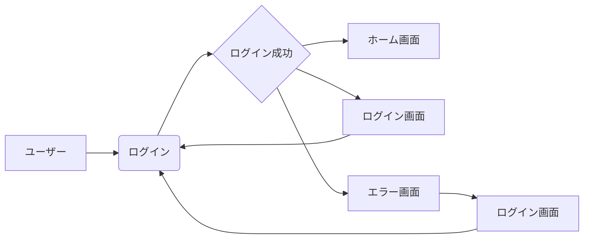


## フローチャート
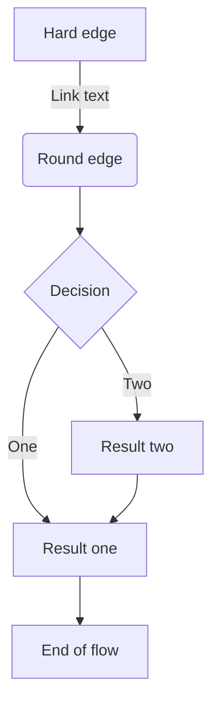


## シーケンス図
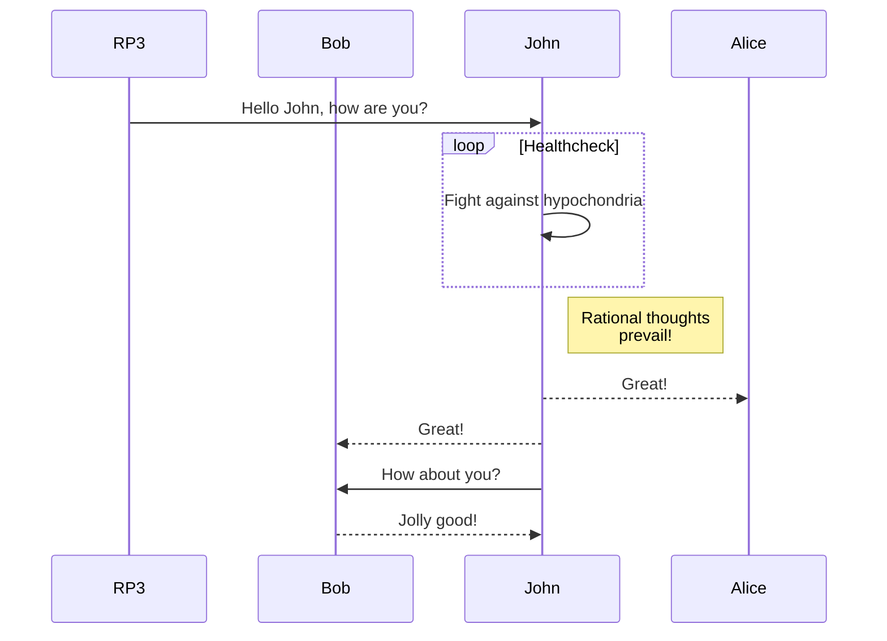


## シーケンス図 スマートメータ
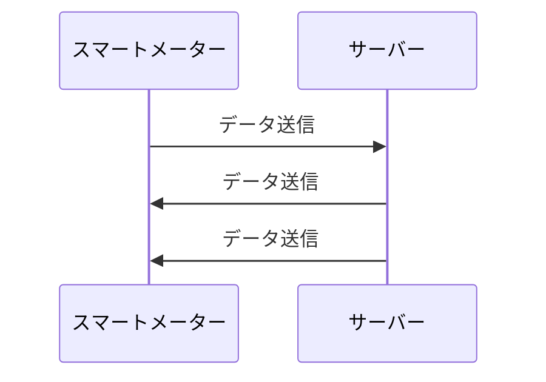


## ガントチャート
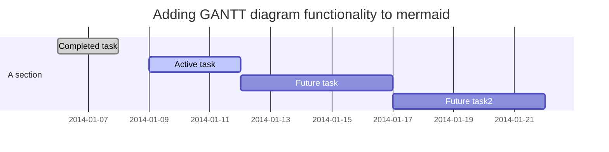


## クラス図 
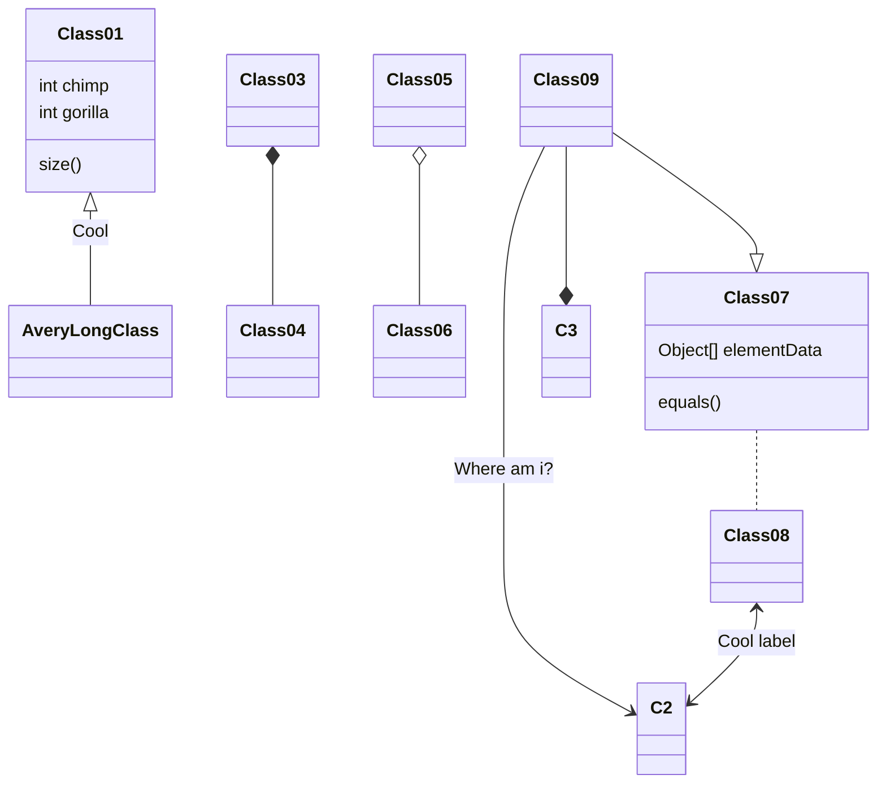


## 状態遷移図
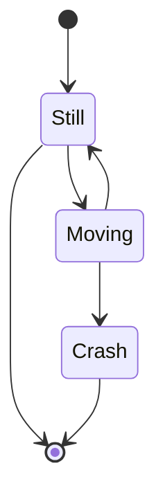


## 円グラフ（パイチャート）
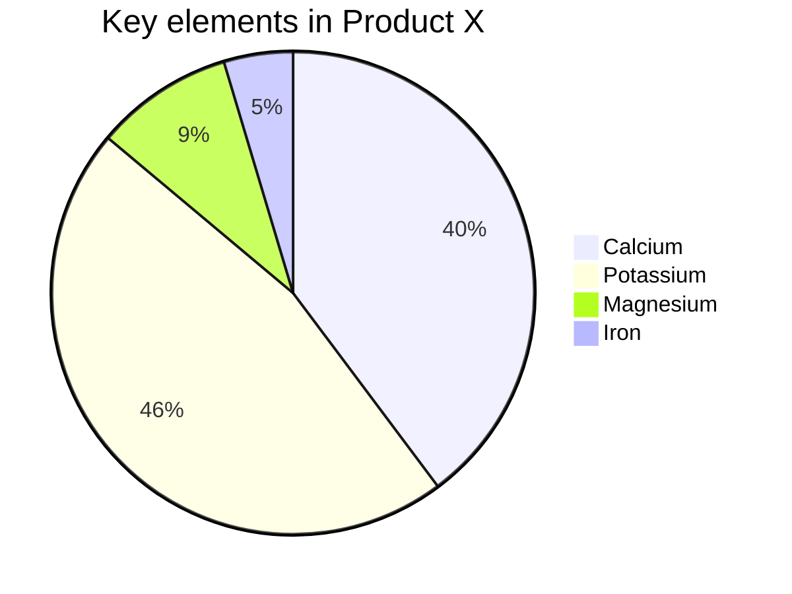


## 散布図
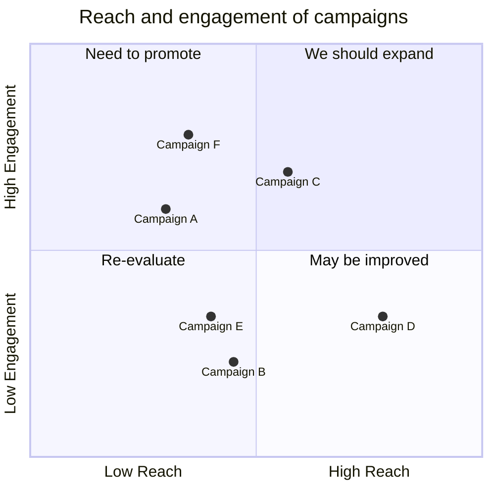


## ER図

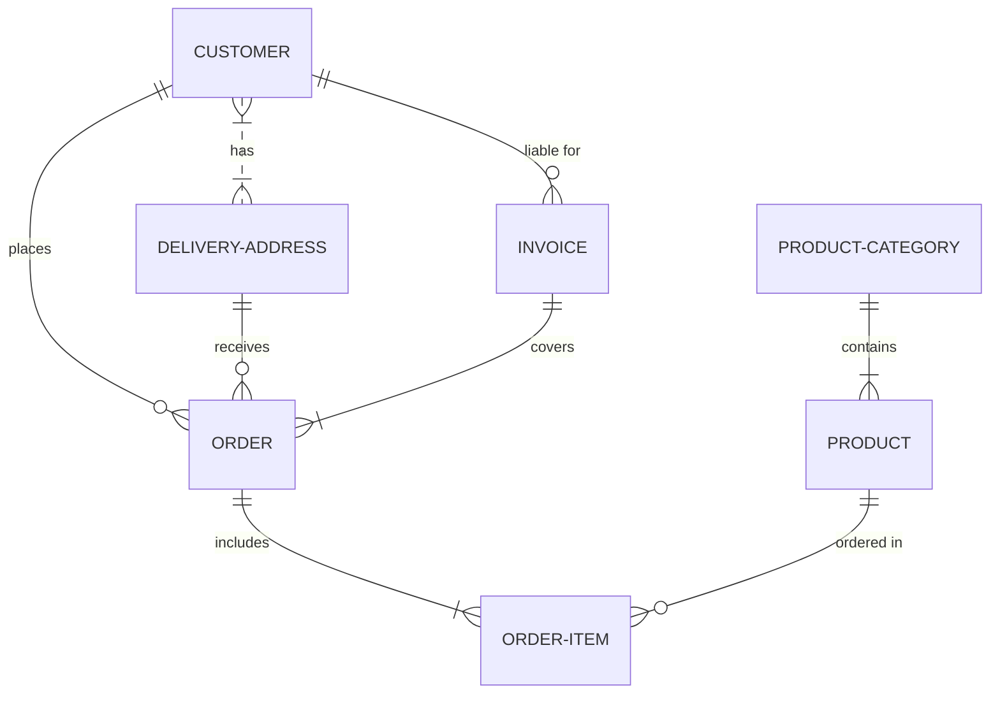


### カスタマー・ジャーニー・マップ
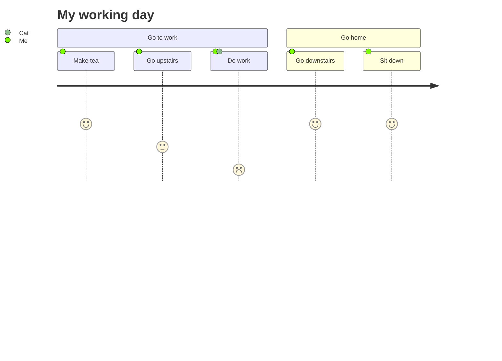


## 画像の挿入


