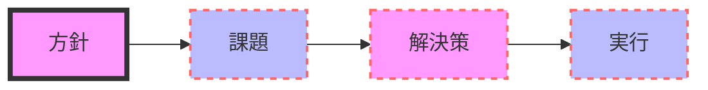
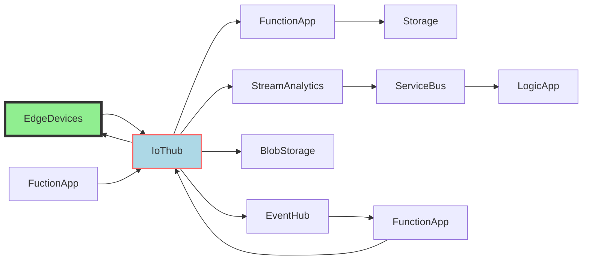
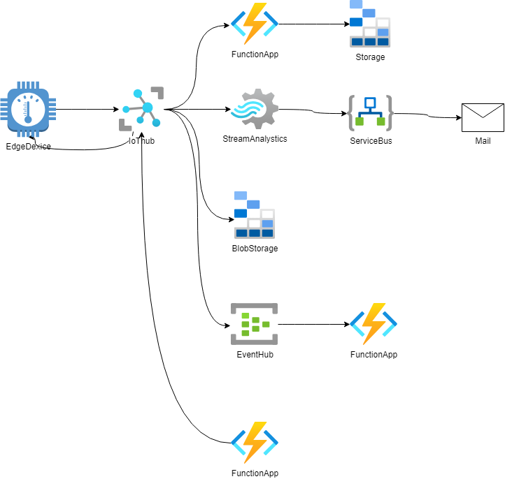

# ブロック図の書き方
*Tags: Markdown, UML, Mermaid, VS Code, block diagram*

## ブロック図とは
1. ブロック図は、システムの構成を表す図である。
1. ブロック図は、システムの構成要素をブロックとして表し、ブロック間の関係を線で表す。

## 使いどころ
システムを俯瞰的に表現することができるため、全体像を知るために使われる
また、ブロックの単位を定義する際、データの入出力を整理する必要があるため、ブロック内で行われる処理を整理するためにも使われる

## 作成方法
1. 入出力を明確にする
1. ブロックの役割を明確にする
1. ブロックの関係を明確にする

### 詳細
1. 入出力で明確にすべきことは
    1. 入出力データの種類 何か？ 【必須】
    1. 入出力データの形式 型、配列数、フォーマット
    1. 入出力データの単位 物理量
    1. 入出力データの精度 有効桁数
    1. 入出力データの範囲 最小値、最大値
    1. 入出力データの制約 条件など

1. ブロックの役割を明確にする
    1. ブロックの役割をブロック名で表現【必須】
    1. ブロックの役割を入出力データの具体的な処理内容で表現

1. ブロックの関係を明確にする
    1. ブロックの関係を線で表現【必須】
    1. データの流れを矢印で表現【必須】
    1. 基本的に左から右、上から下にデータが流れるように表現する【必須】

### 例

---

## Mermaidでブロック図を作成する
### ブロック図の作成（基本）

### ブロック図の作成（矢印の種類を変更）

### ブロック図の作成（ブロックの色を変更：RGB）

### ブロック図の作成（ブロックの色を変更：色の名前で指定）

### ブロック図の作成 １（Mermaid版）

### ブロック図の作成 １（DrawIO版）

### ブロック図の作成 ２（DrawIO版）
