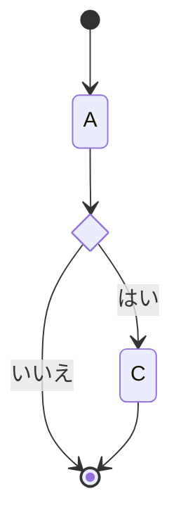
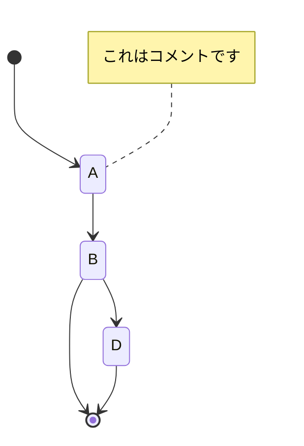
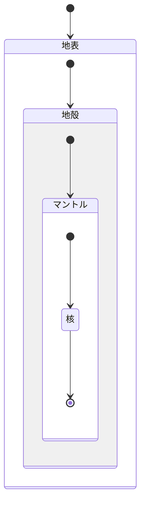

# 状態遷移図の書き方
*Tags: Markdown, UML, Mermaid, VS Code, state diagram*

# 状態遷移図とは
1. 状態遷移図は、システムの状態遷移を表す図である。
1. 状態遷移図は、システムの状態を状態として表し、状態間の遷移を矢印で表す。

## 使いどころ
状態遷移表では表現しきれない、状態間の遷移条件を表現するために使われる
また、実装に近い表現ができるため、実装者が読みやすく、実装の検証にも使うことができる

# 作成方法
1. 状態を明確にする
1. 状態間の遷移条件を明確にする

## 詳細
1. 状態を明確にする
    1. 状態を抽出し、人が読んでわかる状態名で表現する【必須】
1. 状態間の遷移条件を明確にする
    1. 遷移条件と遷移先を明確化【必須】

## Mermaidで状態遷移図を作成する
### 状態遷移図の作成（基本）

### 状態遷移図の作成（分岐の表現）

### 状態遷移図の作成（コメントの挿入）

### 状態遷移図の作成（入れ子の表現）

