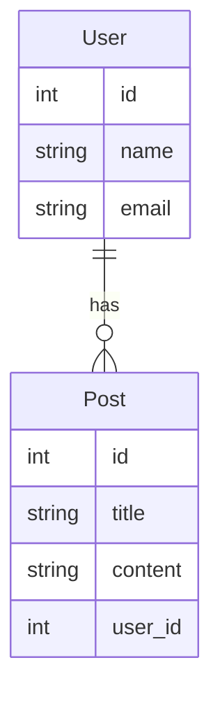
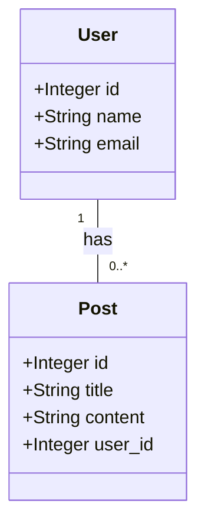

# データベース論理設計 １
*Tags: Markdown, UML, Mermaid, VS Code, RDB*

## 前提知識
> RDBでスキーマを定義したことがある
RDBでテーブルを作成したことがある
RDBの正規化を行ったことがある
    
RDBを業務で使えている開発者が対象

## 目的
> **誰もが同じ様に**データベースの論理設計を行うことができること

同じ要件でも、担当者の力量の差により、成果物が異なってしまうことを避けることを目指す

## RDBとは
1. **R**elational **D**atabaseの略。複数のデータベースを関連付けて使える様にしたデータベースの総称。
1. 特徴としては
    1. データ構造は、テーブル（表）とカラム（列）で表現される
    1. データの関連性は、テーブル間の結合で表現される
    1. データの重複を排除することができる
    1. データの整合性を保つことができる
    1. 事前にデータ構造を示すスキーマを定義する必要があり、データの構造を変更することができない
    1. データ操作は SQL（**S**tructured **Q**uery **L**anguage）と呼ばれる共通（方言はある）言語で行うことができる
    1. トランザクション処理ができ、ACID特性を持つ
        1. **A**tomicity（原子性）：トランザクションの処理は、全て実行されるか、全て実行されないかのどちらかであること
        1. **C**onsistency（一貫性）：トランザクションの処理前後で、データベースの状態が一貫性を持つこと
        1. **I**solation（独立性）：トランザクションの処理中に、他のトランザクションの処理が行われても、処理結果に影響がないこと
        1. **D**urability（永続性）：トランザクションの処理が完了したら、その結果は永続的に反映されること
1. RDB の例として、Oracle、MySQL、SQL Server、PostgreSQL、SQLiteなどが挙げられる。

## 使いどころ
1. **銀行**の口座管理、取引管理
1. **学校**の成績管理、出席管理
1. **オンラインストア**の商品管理、在庫管理、顧客管理
1. **SNS**のユーザー管理、投稿管理
など、様々な場面で使用されている。

## 他の手段 ファイルによるデータ管理
ファイルでもデータを管理することはできるが、データベースと比較して、以下のようなデメリットがある。

1. データの重複が発生する
1. データの整合性が保てない
1. データの検索が遅い
1. データの追加、更新、削除が難しい
1. データのバックアップが難しい
1. データの共有が難しい

この様なデメリットが発生する原因の一つとして、ファイル自体にデータの構造がなく、直接的にお互いの関連性を持たすことができないことが挙げられる。
また、同じ内容のデータであっても実体はそれぞれのファイルに持つことになるため、データの構造を変更する場合は、全てのファイルを変更する必要があるため、データの整合性を保つコストが高くなる。

逆に言うと、これらのデメリットを解消するものとして RDB が考え出された。

**商品マスタ**
商品名 | 単価
--- | ---
りんご | 100
みかん | 80

**売上データ 大須支店**
日付 | 顧客 | 商品名 | 数量
--- | --- | --- | ---
2020/11/01 | 佐藤 | りんご | 2
2020/11/01 | 大橋 | みかん | 3
2020/11/02 | 高橋 | りんご | 1

**売上データ 岡崎駅前支店**
日付 | 顧客 | 商品名 | 数量
--- | --- | --- | ---
2020/11/01 | 鈴木 | りんご | 2
2020/11/01 | 伊藤 | みかん | 3

データベースによるデータ管理の場合、商品マスタのりんごの商品名が変わった場合、商品マスタだけを変更すれば良いが、ファイルによるデータ管理の場合は、全てのファイルを変更する必要がある。

## 他の手段 NoSQLによるデータ管理
インターネットの発展と共に扱うデータ量が飛躍的に増大し、また、データ構造も多種多様なものへと変化してきた。
大量の不定形データを扱う場合は、RDB の様にスキーマが固定されていると、データ構造の変更のオーバーヘッドが大きくなるため、スキーマレスのデータ構造を柔軟に変更できるデータベースが考え出された。それが、NoSQL と呼ばれるデータベースである。NoSQL はそれ自体特定のデータベースを表しているわけではなく、SQL で操作する RDB とは異なるアーキテクチャで動作するものの総称。代表的なものとしては、MongoDB、Cassandra、Redis、CouchDB、DynamoDB などが挙げられる。

NoSQLの特徴：
1. データモデルが柔軟
1. データの追加、更新、削除が容易
1. データの検索が高速
1. データの共有が容易
1. データのバックアップが容易
1. データの整合性が保てない NG
1. データの重複が発生する NG

必ずしもRDBよりもNoSQLの方が優れているわけではなく、データの特性によって使い分ける必要がある。

## データベースの論理設計
データベースの論理設計とは、データベースの構造を決める作業のことである。
重要なのは、データベースの構造を決める前に、どのようなデータを管理するのかを明確にすることである。リレーションを検討し、正規化を行うことで、データの整合性を保つことができる。

これに対し、データベースの物理設計とは、データベースの論理設計を元に、データベースを実際に作成し、パフォーマンスのチューニング、障害監視などのメンテナンスをしやすくする作業のことである。

データベースの論理設計手順:
1. データの分析
1. データの分類
1. データの関連性の分析
1. データの正規化

    --> データの構造の決定

## 1. データ分析

### トップダウン
1. サービスの目的を明確にする
1. サービスの目的を達成するために必要なデータを明確にする
1. サービスの目的を達成するために必要なデータを分析する
1. サービスの目的を達成するために必要なデータを収集する
1. データ構造を定義する

特徴：
- システムを俯瞰的に捉えることができる 〇
- あるべき姿を見失いにくい 〇
- 抜け漏れを防げる 〇
- データの分析が難しい X
- 業務の正確な理解が必須 X

担当者の力量により成果物が異なってしまう原因となる

### ボトムアップ
1. 現場で使用しているデータを収集する
1. 実際に使用している Excel や 報告書 からデータを抽出する
1. データを分析する
1. データ構造を定義する

特徴：
- 動くシステムを確実に作ることができる 〇
- 業務の理解は必須ではない 〇
- データの分析が容易 〇
- 現物合わせとなり、あるべき姿を見失いやすい X
- 抜け漏れの検証を行う手段がない X

誰が実施しても同じ結果を得られる一方、業務の理解がないため、本当に必要なデータを抽出できているかが不明瞭となる

### 現実解
1. トップダウンとボトムアップの両方を行う
1. トップダウンで抜け漏れがないかを確認する
1. ボトムアップで現物合わせを行う

両方の手法のメリット・デメリットを把握して適用することが重要である

## 2. データの分類
データ分析を行った結果を元に、テーブル・カラムを作成する

1. テーブルを作成する
1. テーブルにカラムを追加する

一度で厳密に定義することにこだわらず、全体としてやりたいことを表現できるか確認しながら、何度か繰り返して定義していく。
テーブルやカラム名の命名規則に、一般的なルールは存在せず、開発環境やプロジェクトのルールに従うことになる。

User
| 列名 | データ型 | 制約 |
| ---- | -------- | ---- |
| id | INTEGER | PRIMARY KEY |
| name | VARCHAR(100) | NOT NULL |
| email | VARCHAR(100) | NOT NULL, UNIQUE |

Post
| 列名 | データ型 | 制約 |
| ---- | -------- | ---- |
| id | INTEGER | PRIMARY KEY |
| title | VARCHAR(100) | NOT NULL |
| content | TEXT | NOT NULL |
| user_id | INTEGER | FOREIGN KEY REFERENCES Users(id) |

## 3. データの関連性の分析
データベースの構造は、テーブルとカラムで表現される。
**テーブル**は、データの集合体であり、**カラム**は、データの属性である。

なお、データベースの構造は、データベースの観点から見るか、アプリケーションの観点から見るかによって、テーブルは **モデル**・**エンティティ** ・**クラス**、カラムは**プロパティ**・**属性**に相当することもある。表現上の都合であり、根本的に同じことを表現していることもあるため、文脈から判断して、適宜読み替えればよい。

ER図

クラス図

## キーの種類
データベース間は各種キーによりリレーション（関連）を持つことができる。

**候補キー**：主キーになりうるカラム
**主キー**：テーブル内で一意になるカラム
**外部キー**：他のテーブルの主キーを参照するカラム

### 候補キーの決め方
1. テーブル内で一意になるカラムを選ぶ
1. テーブル内で一意になるカラムがない場合は、複数のカラムを組み合わせて一意になるカラムを作る

### 主キーの決め方
1. 候補キーの中から、一番使いやすいカラムを選ぶ
1. 候補キーの中から、一番使いやすいカラムがない場合は、複数のカラムを組み合わせて一意になるカラムを作る

### 外部キーの決め方
1. 他のテーブルの主キーを参照するカラムを作る

## 制約の種類
データベースには、データの整合性を保つために、以下のような制約を設定することができる。
制約を設定することで、アプリケーション側で制約を実装しなくても、データベースの機能のみで、他から参照されいているデータを削除したり、存在しないデータに紐づけるといいった不整合が起こらないようにすることができる。

**NOT NULL**：カラムに NULL を許可しない  
**UNIQUE**：カラムの値が一意であることを保証する  
**PRIMARY KEY**：カラムの値が一意であることを保証する  
**FOREIGN KEY**：他のテーブルの主キーを参照するカラムであることを保証する  
**CHECK**：カラムの値が指定した条件を満たすことを保証する  
**DEFAULT**：カラムの値が指定した値になることを保証する  

ただし、必ずしもデータベースで制約を設定することが最善ではなく、実装上、あえてデータベースではなくアプリケーション側で制約を実装することで、エラーハンドリングをしやすくする工夫を行うこともある。

以下、第二回へ続く