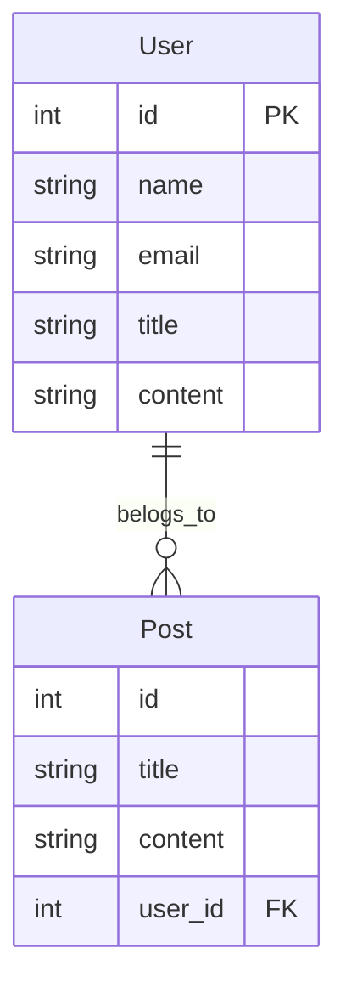
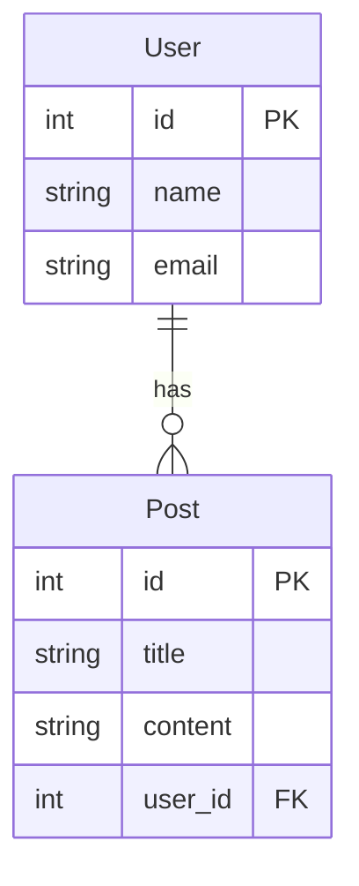
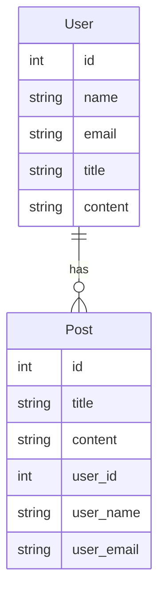
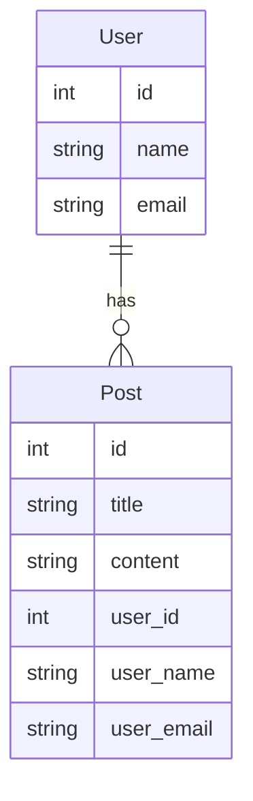
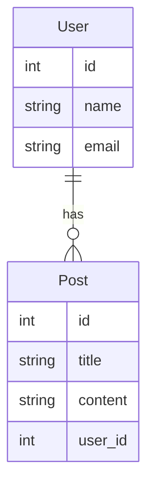
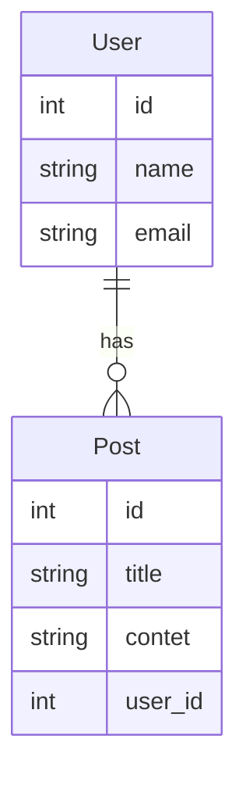
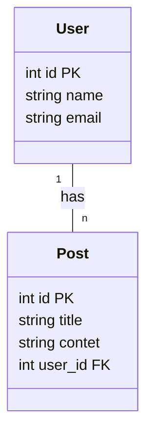
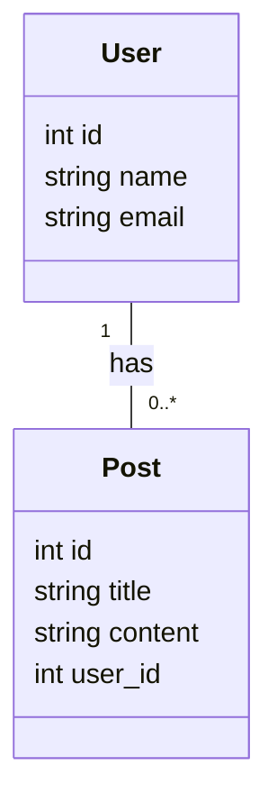
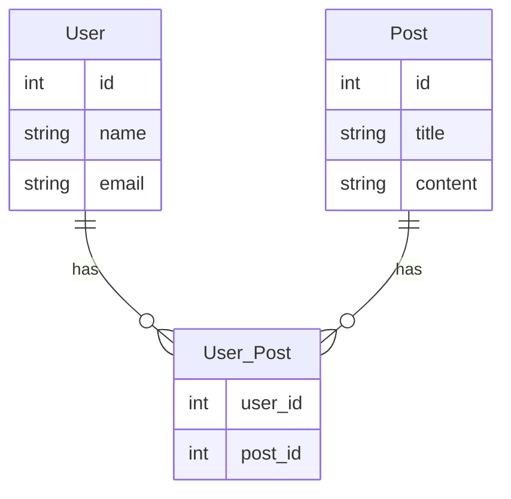
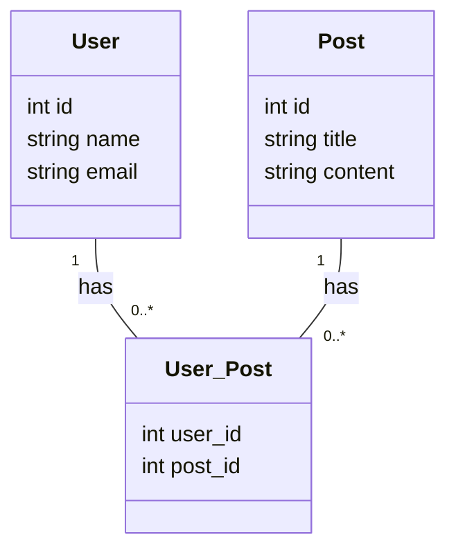

# データベース論理設計 2
*Tags: Markdown, UML, Mermaid, VS Code, RDB*

前回に引き続き、データベースの論理設計の手順を学んでいく。今回はデータの正規化、リレーションの種類について、Mermaid による ER図・クラス図の書き方を通し学んでいく。

## 4. データの正規化
データの正規化とは、データの欠損・重複を排除し、データの整合性を保つための手法である。

正規化のメリット
1. データの欠損・重複を排除できる
1. データの整合性を保つことができる
1. データの更新、追加、削除が容易になる

正規化のデメリット
1. データの参照が複雑になる
1. データの参照が遅くなる

## 用語

### 関数従属性
関数従属性とは、あるカラムの値が決まれば、別のカラムの値が決まることを表す。例えば、ユーザーの名前が決まれば、ユーザーのメールアドレスが決まる。この場合、ユーザーの名前はユーザーのメールアドレスに関数従属性があるという。

A → B という関係が一意に成り立つ場合、関数従属しているという。

### 部分関数従属性
部分関数従属性とは、複数のカラムの値が決まれば、別のカラムの値が決まることを表す。例えば、ユーザーの名前とメールアドレスが決まれば、ユーザーの住所が決まる。この場合、ユーザーの名前とメールアドレスはユーザーの住所に部分関数従属性があるという。

A, B → C という関係が成り立つ場合、A → C という関係が成り立つことを部分関数従属しているという。

例）社員
| A 部署名 | B 勤務地 | 氏名 |
|:---|:---|:---|
| 人事部 | 大阪 | 佐藤 |

### 推移関数従属性
推移関数従属性とは、あるカラムの値が決まれば、別のカラムの値が決まることを表す。例えば、ユーザーの名前が決まれば、ユーザーの住所が決まる。ユーザーの住所が決まれば、ユーザーの電話番号が決まる。この場合、ユーザーの名前はユーザーの電話番号に推移関数従属性があるという。

A → B → C という関係が成り立つ場合、A → C という関係が成り立つことを推移関数従属しているという。

例）社員
| A 社員番号 | 氏名 | 顧客 | 顧客窓口 |
|:---|:---|:---|:---|
| 100 | 佐藤 | モーター社 | 鈴木 |
| 200 | 大橋 | モーター社 | 鈴木 |
| 300 | 高橋 | コンパス社 | 伊藤 |

## 正規化の種類

### 第一正規化
非正規形とは、データの欠損・重複を排除せず、データの整合性を保たない状態のことである。これを解消するため、

1. データの欠損・重複が無い様、データを整理
1. データの幅を整える

を行うと第一正規形となる。
ただ、RDBを使用するための前提条件であるため、ファイルからRDBにデータを格納した時点でこの問題は解消されているため、あまり意識することはない。

例：
正規化前
| id | name | email | title | content |
|:---|:-----|:------|:------|:--------|
| 1  | 佐藤 | sato.sato@codez.jp |
| 2  | 大橋 | ohashi.ohashi@codez.jp
| 3  | 高橋 |
| 4  | 大橋 | ohashi.ohashi@codez.jp

正規化後
| id | name | email |
|:---|:-----|:------|
| 1  | 佐藤 | sato.sato@codez.jp |
| 2  | 大橋 | ohashi.ohashi@codez.j|p
| 3  | 高橋 |taka.taka@codez.jp|

### 第二正規化
第一正規化を行った後に、カラム間・テーブル間などでデータの重複がある場合、さらなる正規化が必要となる。

第二正規化が必要なデータ格納状況の例を markdown の表で表すと以下のようになる。

| id | name | 役職 |
|:---|:---|:--------|
| 1  | 佐藤 | 部長 |
| 2  | 大橋 | 部長 |
| 3  | 大橋 | 室長 |

上記の例では、大橋さんが部長と室長の2つの役職を持っている。このように、1つのデータに対して、複数のデータが紐づく状態を多重従属という。多重従属がある場合、データの更新、追加、削除が容易にならない。

これを解消するため

1. テーブル内に重複したカラムがないかを確認する
1. テーブル内に重複したカラムがある場合は、それらを別のテーブルに移動する  

を行うと第二正規形となる。

例:
正規化前

正規化後

### 第三正規化
第二正規化を行った後に、テーブル内に主キー以外のカラムが主キーに依存している場合、さらなる正規化が必要となる。
この状態は部分関数従属や、推移関数従属と呼ばれる。

1. テーブル内に主キー以外のカラムが主キーに依存しているかを確認する
1. テーブル内に主キー以外のカラムが主キーに依存している場合は、それらを別のテーブルに移動する

第二正規化の例:
正規化前

正規化後

例：
正規化前

正規化後

## 5. リレーションの種類
データベース間は各種リレーション（関連）を持つことができる。

**1対1**：1つのデータに対して、1つのデータが紐づく
**1対多**：1つのデータに対して、複数のデータが紐づく
**多対多**：複数のデータに対して、複数のデータが紐づく

### 1対1
1対1のリレーションは、1つのデータに対して、1つのデータが紐づくリレーションである。
例えば、ユーザーとプロフィールのリレーションは、1対1のリレーションである。
ユーザーは、1つのプロフィールを持ち、プロフィールは、1つのユーザーに紐づく。

ER図

クラス図

### 1対多
1対多のリレーションは、1つのデータに対して、複数のデータが紐づくリレーションである。
例えば、ユーザーと投稿のリレーションは、1対多のリレーションである。
ユーザーは、複数の投稿を持ち、投稿は、1つのユーザーに紐づく。

ER図

クラス図

### 多対多
多対多のリレーションは、複数のデータに対して、複数のデータが紐づくリレーションである。1対多のリレーションを2つ組み合わせて表現することができる。

ER図

クラス図

