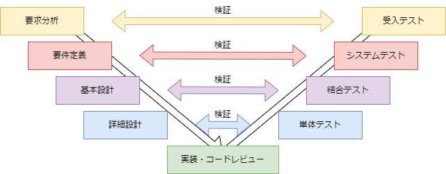
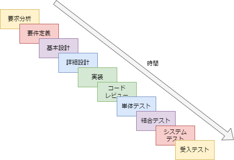

# ソフトウェア開発手法

## なぜ必要か？
プロジェクトでサービスやモノを開発する際、何のため・何を・どの様に作るのかといったこと明確化することは重要である。意思疎通が容易に行える小規模な開発であれば、これらを暗黙的な合意により進められるケースもある。実際、開発スピードという点では、細かな取り決めやルールを行うプロセスより開発そのものに時間をかける方がうまくいく場合もある。しかし、開発規模が大きくり関係者が増えると、各々の意思疎通を正確に行うための時間が多くかかる様になる。また、意思疎通が取れないまま開発を進めると、最終的なサービスやモノの認識にずれが生じ、機能・品質を満たせない、納期に間に合わないといったリスクを招いてしまう。

ソフトウェア開発においては、過去の多くの失敗から、対策が考案されている。それらを参考にしながら進めることで、効果的にリスクの低減を図ることができる。

## 一番重要なことは？
まず、 **誰のために何を解決したいのか** を明確にする必要がある。
この二つをセットにするのは、しばしば、解決したいことだけが先行し、誰のために開発するのかが後回しになってしまうことを避ける意味がある。開発の進め方や成果物が曖昧になってしまい、開発の目的を見失ってしまうことを避ける意味もある。

開発手法は様々なものが提案されているが、この二つは共通の要素として挙げらられ、プロジェクトにおいて **終始一貫させることが最重要** である。プロジェクトを進める上で、計画の見直しが発生することは良くあるが、ここに関わる見直しが発生する場合、その時点でプロジェクトは失敗していることを意味する。何故ならプロジェクトの目的が変わってしまったことを意味するからである。この場合、プロジェクトはゼロからの再スタートとなる。

## V字モデル開発
何のために開発するのかを決めたら、次に何を作るのかを決め開発するのかを決める必要がある。ここからは、採用する開発手法によって異なるが、本ページではソフトウェアの開発工程を示す図として用いられることが多い、`V字モデル` を参照して説明していく。

開発工程とそれを検証する項目を対にして示した図であり、上流から下流、左側から右側に向かって進む。次工程への移行は、前工程の検証が完了していることが条件となる。
検証を行うテスト項目は各開発工程と対応している。

メリット：
1. 開発工程が順序立てて進むため、計画立案が容易。
1. 開発工程の移行条件が明確なため、進捗が可視化しやすく、進捗管理が容易。
1. 開発工程が進む際に、前工程の検証が完了しているため、品質を担保しやすい。
1. 発注者側が少ない工数で発注を行うことができる。

デメリット：
1. 要件定義が完了するまで、開発工程が進められない。
1. 移行条件を計画初期に決める必要があるため、抜け漏れが発生し易い。
1. 下位工程に行くほど、テスト項目が増えるため、開発後期に工数不足が発生し易い。
1. 受入れ時まで、発注側がサービスやモノを確認できない。

### 要求分析 → 受入れテスト
**発注側の要望** を明確にする工程。開発を行う目的や効果、リソース・納期・予算、納品形態、保守方法などを明確にしていく。
受入れテストは、最終テスト位置づけであり、開発したサービスやモノを **実運用環境において問題ないこと** を検証できる項目とする。

### 要件定義 → システムテスト
**システムの成立性** を明確にする工程。開発するサービスやモノの機能を明確にするとともに、非機能要件であるレスポンス性能などを明確にしていく。
システムテストは、完成したサービスやモノが **システムとして成立するか** を検証できる項目とする。

### 基本設計 → 結合テスト
システムを構成する **各要素（モジュール、コンポーネント、サービスなど）間の連携動作** を明確にしていく。
結合テストは、**各要素が連携して動作すること** を検証できる項目とする。

### 詳細設計 → 単体テスト
基本設計で明確にした各要素を、**実際に開発するための仕様** に落とし込む工程。
単体テストは、単体で **各要素が動作すること** を検証できる項目とする。

### 実装 → コードレビュー
詳細設計で明確にした **仕様を実装** する工程。
コードレビューは、**実装したコードが仕様を満たしているか** 検証する工程。検証項目としては静的解析ツールや、コーディング規約などをツールを用いて全体的に行うことが一般的で、ここでは、実装したコードそのもののレビューを指している。

### 補足 ウォータフォールモデルへのV字モデルの展開

ウォータフォールモデルは、水が流れる様に上から下に連続して定義される工程である。V字モデルの開発工程を、左から右に向かって進めることを前提とした開発手法であるため、相互に適用することができる。

## 要求分析手法
要求分析は、発注側の要望を明確にする工程であるため、発注側の要望を明確にするための手法を用いる。ここでは、代表的な要求分析手法を紹介する。
紹介する手法は **適用範囲はそれぞれ異なる** ため、採用時に適用範囲を確認する必要がある点注意が必要である。

### RFP
RFP（Request For Proposal）は、発注側が、発注するサービスやモノの要件を明確にし、それを満たす提案を募集するための手法である。主に情報システムの開発に用いられることが多く、発注者が受注者を選定する際、候補となるシステム開発会社に提示するのが一般的である。

RFPは、以下のような構成要素から構成される。
- プロジェクト概要
- 提案依頼概要
- 機能要求
- 非機能要求
- 開発手法要求
など

#### 適用範囲
項目名|適用可否|備考
---|:---:|---
要求定義|〇|
要件定義|△|RFPの構成要素だが、RFPの依頼自体に含めることも多いため、用いられることは稀。
基本設計|×|
詳細設計|×|
実装|×|

#### プロジェクト概要
システム導入の背景、目的、開発スケジュールなどを記述する。

現状把握を行い困りごとを明確にし、その導入効果を記述する。何をいつまでに作るのかを明確にする。ここには、システムの利用者や利用方法、利用環境、利用目的、利用頻度、利用者の属性なども記述する。

#### 提案依頼概要
依頼範囲と前提を記述する。

依頼範囲を明確にすると共に、依頼前提に関する取り決めを明確にする。

#### 機能要求
システムの機能要件を記述する。

必要な機能を明確にすると共に、優先度を明確にする。

#### 非機能要求
システムの非機能要件を記述する。

機能要件に現れない要求を明確にし、受入れ必須条件になるか明確にする。

#### 開発手法要求
設計・開発・テストの手法要件を記述する。

開発全般での取り決めを明確にする。

#### 補足 RFPの構成要素
RFPの構成要素は、プロジェクトによって異なるため、必要に応じて追加・削除することができる。また、構成要素の記述方法もプロジェクトによって異なるため、必要に応じて変更することができる。

#### 記述例
- [RFP](./RPF-sample.md)

### USDM
USDM（User Story Driven Modeling）は、ユースケースを用いて、システムの利用者がシステムをどのように利用するのかを記述したものである。USDMは、システムの利用者がシステムをどのように利用するのかを明確にするために用いられる。

#### 適用範囲
項目名|適用可否|備考
---|:---:|---
要求定義|△|開発手法によっては、要求定義を行わないため、用いることは稀。また、何をよりどうやってに主眼が置かれるため、用いることは稀。
要件定義|〇|
基本設計|×|
詳細設計|×|
実装|×|

#### 構成要素
USDM はユースケース図ではなく、表形式で表すこと一般的で、以下のような構成要素から構成され、ユースケースID と ユースケース名 は必須である。階層構造を持つことができ、上位の要求を満たすために下位のユースケースを実行することができる。

- ユースケースID
- ユースケース名
- アクター
- 前提条件
- トリガー
- 基本フロー
など

#### 記述例
- [USDM](./USDM-sample.md)
